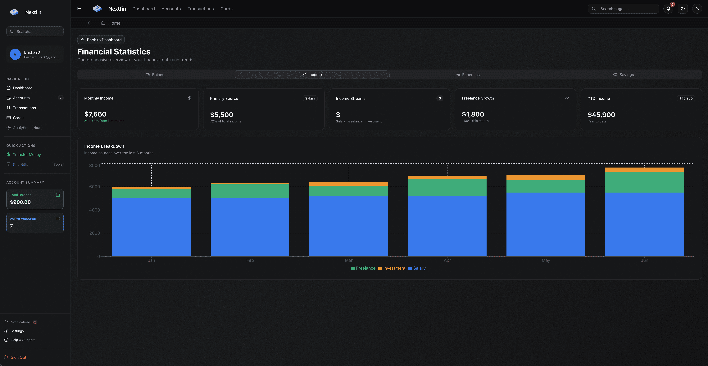

# Nextfin UI

Nextfin UI is the frontend for the [Nextfin Platform](https://github.com/mihavo/nextfin), built with React, TypeScript & shadcn/ui.

## Screenshots

<div align="center">
  
  
  <br/>
  
  
  <br/>
</div>

## Getting Started

### Prerequisites

- Node.js >= 18
- pnpm (preferred package manager)

### Installation

1. Clone the repository:

   ```sh
   git clone https://github.com/your-username/nextfin-ui.git
   cd nextfin-ui
   ```

2. Install dependencies:

   ```sh
   pnpm install
   ```

3. Start the development server:

   ```sh
   pnpm dev
   ```
